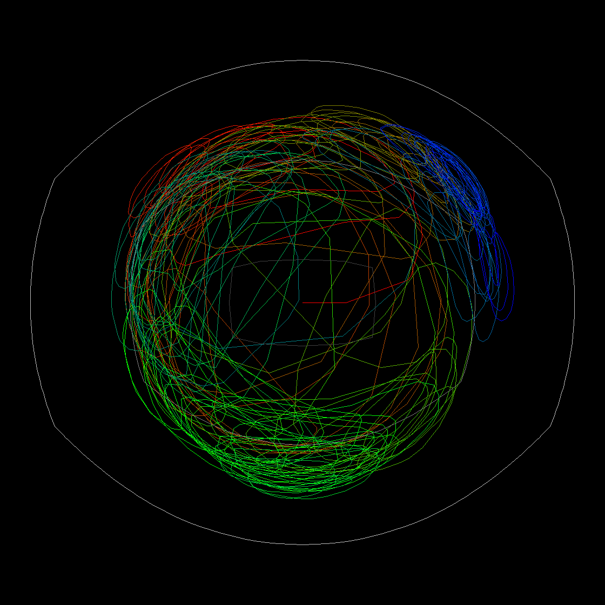

# EWalkLn

Random walk meets digits of e, meets neat visualization

## What is this?

*An absolute ripoff of [Ben Wiederhake's PiWalkLn](https://github.com/BenWiederhake/PiWalkLn)
with a twist. This world should never go more than a few hours without a project with pi
not matched by a project with e! e is better! Empirically! See, e is capitalized, pi
is not!*

Take the digits of e, use them as walking instructions, turn by a
fixed angle after each digit. As it is conjectured that one can [consider e 
behaves normally](https://en.wikipedia.org/wiki/Pi#Properties), the walk may
stay reasonably close to the starting point.

(3k digits with angle 15.54°)

Don't get me wrong, e *does* wander off considerably, but in relation
to how far away it *could* go, it's not much.

## Why the fisheye?

Like I said, e is an untamed beast that likes to wander both the
unexplored paths of the canvas and the well-known neighborhood of it's
own tail. You can read up on why Wiederhake decided on the fisheye and how he
achieved the effect in the [original PiWalkLn
README](https://github.com/BenWiederhake/PiWalkLn#why-the-fisheye).

## So what does it look like?

Thanks for asking! I want to show you even more images:

(10k digits with angle 77.87°)

(30 digits with angle 15.54°)

For more samples, look at the `samples` folder. Or, hey, why don't you
clone it and experiment yourself? Feel free to share awesome images by
making a PR :D
